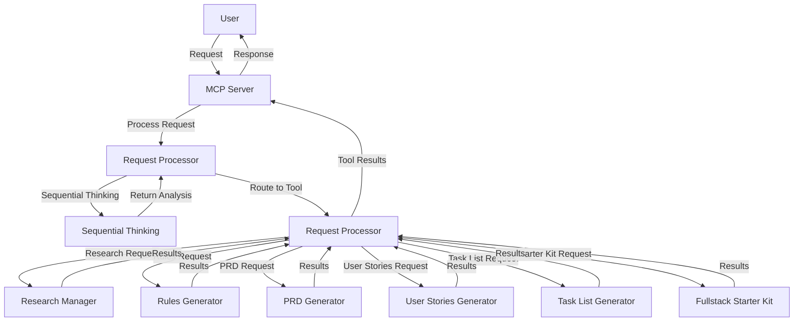
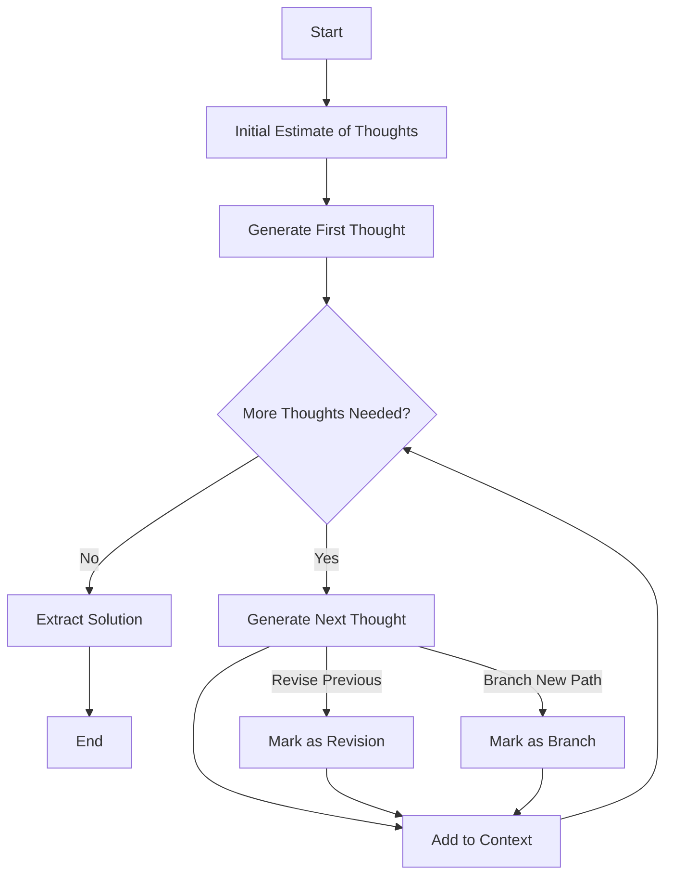

# Vibe Coder MCP Server

An MCP server that provides stateless tools and generators for AI-assisted development. This server enhances AI-powered development environments with tools for research, planning, and requirements generation.

## Overview

Vibe Coder MCP integrates with Claude Desktop and other MCP-compatible clients to provide the following capabilities:

- **Sequential Thinking**: Processes problems through a flexible, step-by-step thinking approach
- **Request Processor**: Routes and manages requests to appropriate specialized tools
- **Research Manager**: Deep research capabilities using Perplexity Sonar
- **Rules Generator**: Creates development rules tailored to specific projects
- **PRD Generator**: Produces detailed product requirements documents
- **User Stories Generator**: Creates structured user stories with acceptance criteria
- **Task List Generator**: Develops detailed development task lists with dependencies
- **Fullstack Starter Kit Generator**: Creates custom project starter kits with tailored tech stacks

## Requirements

- Node.js 16 or higher
- npm
- OpenRouter API key (for accessing LLMs)

## Installation

### Windows

1. Clone or download this repository
2. Open PowerShell or Command Prompt in the project directory
3. Run the setup script:
   ```bash
   .\setup.bat
   ```
4. Edit `.env` file to add your OpenRouter API key

### macOS/Linux

1. Clone or download this repository
2. Open Terminal in the project directory
3. Run the setup script:
   ```bash
   chmod +x setup.sh
   ./setup.sh
   ```
4. Edit `.env` file to add your OpenRouter API key

## Starting the Server

After installation, start the server with:

```bash
npm start
```

For SSE transport (HTTP interface), use:

```bash
npm run start:sse
```

## Project Structure

```
vibe-coder-mcp/
├── .env                  # Environment configuration
├── mcp-config.json       # MCP configuration
├── package.json          # Project dependencies
├── README.md             # This file
├── setup.bat             # Windows setup script
├── setup.sh              # macOS/Linux setup script
├── tsconfig.json         # TypeScript configuration
└── src/                  # Source code
    ├── index.ts          # Entry point
    ├── server.ts         # MCP server setup
    ├── services/         # Support services
    │   ├── hybrid-matcher/       # Hybrid matching service
    │   ├── intent-service/       # Intent recognition
    │   ├── matching-service/     # Pattern matching
    │   └── request-processor/    # Request processing
    ├── tools/            # Tool implementations
    │   ├── fullstack-starter-kit-generator/
    │   ├── prd-generator/
    │   ├── research-manager/
    │   ├── rules-generator/
    │   ├── sequential-thinking.ts
    │   ├── task-list-generator/
    │   ├── user-stories-generator/
    └── types/            # TypeScript type definitions
        ├── globals.d.ts
        ├── tools.ts
        └── workflow.ts
```

## Features

### Sequential Thinking Tool

The Sequential Thinking tool implements a dynamic problem-solving approach that moves through a flexible thinking process:

- **Dynamic Problem Analysis**: Breaks down complex problems into sequential thoughts that build upon previous insights
- **Adaptive Processing**: Adjusts the number of thinking steps as understanding deepens
- **Revision Capability**: Can question, revise, or branch from previous thoughts
- **Solution Verification**: Verifies hypothesis based on the complete chain of thought
- **JSON-Based Structure**: Structures thoughts with metadata tracking sequence, revisions, and branching

The tool leverages OpenRouter to access powerful LLMs for this cognitive process, ensuring thorough analysis of complex problems before generating responses.

### Request Processor

The Request Processor is the orchestration layer that:

- Handles routing of requests to appropriate specialized tools
- Validates inputs across all tools
- Processes tool-specific parameters
- Manages request/response handling for the MCP protocol

### Tools and Functions

#### Research Manager
Performs comprehensive research using Perplexity Sonar through OpenRouter, saving research results to structured markdown files.

#### Rules Generator
Creates project-specific software development rules based on product descriptions and user stories, with storage in both the workflow agent directory and IDE-specific rules directories.

#### PRD Generator
Generates comprehensive product requirements documents following industry best practices, including executive summaries, problem statements, user personas, requirements, and more.

#### User Stories Generator
Creates detailed user stories with acceptance criteria, priorities, and identifiers, following the format: "As a [user type], I want [action] so that [benefit]."

#### Task List Generator
Builds structured development task lists with dependencies, based on user stories and product descriptions, suitable for project planning.


#### Fullstack Starter Kit Generator
Creates customized project starter kits based on specified use case, tech stack preferences, and optional features.

## System Flow



## Integration with Claude Desktop

Follow these detailed steps to integrate the Vibe Coder MCP server with Claude Desktop:

### 1. Start the MCP Server for Claude

1. Open a command prompt or terminal window
2. Navigate to your vibe-coder-mcp directory:
   ```bash
   cd path/to/vibe-coder-mcp
   ```
3. Ensure you've completed the installation steps above, including adding your OpenRouter API key to the `.env` file
4. Start the server in standard mode:
   ```bash
   npm start
   ```
   The terminal should display: "Vibe Coder MCP server running on stdio"

### 2. Add MCP Configuration to Claude Desktop

Claude Desktop stores MCP configuration in a JSON settings file. The location depends on your operating system:

#### Windows
```
C:\Users\[username]\AppData\Roaming\Claude\claude_desktop_config.json
```

#### macOS
```
~/Library/Application Support/Claude/claude_desktop_config.json
```

Follow these steps to add the configuration:

1. Open the Claude Desktop configuration file in your text editor
2. Find or create the `mcpServers` object in the file
3. Add a new entry for the Vibe Coder MCP, following this format:

```json
"mcpServers": {
  "vibe-coder-mcp": {
    "command": "node",
    "args": ["path/to/vibe-coder-mcp/build/index.js"],
    "env": {
      "OPENROUTER_API_KEY": "your_openrouter_api_key_here",
      "OPENROUTER_BASE_URL": "https://openrouter.ai/api/v1",
      "GEMINI_MODEL": "google/gemini-2.5-pro-exp-03-25:free",
      "PERPLEXITY_MODEL": "perplexity/sonar-deep-research",
      "PORT": "3000"
    },
    "disabled": false,
    "autoApprove": ["research", "generate-rules", "generate-prd", "generate-user-stories", "generate-task-list", "generate-fullstack-starter-kit", "process-request"]
  }
}
```

**Important notes about this configuration:**
- Replace `"path/to/vibe-coder-mcp/build/index.js"` with the actual full path to the built index.js file
- Use forward slashes (/) in the path, even on Windows
- The `autoApprove` array specifies which tools Claude can use without asking for your permission
- The `env` object should contain the same environment variables as in your `.env` file
- Make sure to use your actual OpenRouter API key in the configuration

### 3. Verify API Key Configuration

Ensure your OpenRouter API key is:
1. Correctly set in the `.env` file in your vibe-coder-mcp directory
2. Correctly copied to the Claude Desktop configuration file in the `env` section
3. Valid and has sufficient credits on your OpenRouter account

### 4. Restart Claude Desktop

1. Close Claude Desktop completely (including from the system tray/menu bar if applicable)
2. Relaunch Claude Desktop
3. Claude should now connect to your running Vibe Coder MCP server on startup

### 5. Test the Integration

To verify the integration is working:
1. In Claude, try using one of the tools by typing a relevant command, such as:
   ```
   Research modern JavaScript frameworks
   ```
   or
   ```
   Create a PRD for a task management application
   ```
2. Claude should connect to your MCP server, process the request, and return results
3. Check your server terminal for log messages confirming the request was processed

## Configuration

All configuration options are available in the `.env` file:

```bash
# OpenRouter Configuration
OPENROUTER_API_KEY=your_openrouter_api_key_here
OPENROUTER_BASE_URL=https://openrouter.ai/api/v1
GEMINI_MODEL=google/gemini-2.5-pro-exp-03-25:free
PERPLEXITY_MODEL=perplexity/sonar-deep-research

# Server Configuration
PORT=3000
```

## Generated File Storage

All outputs from the tools are stored in the `workflow-agent-files` directory with subdirectories organized by tool. These files serve as a historical record of generated content but are not used as active context by the tools themselves:

```bash
workflow-agent-files/
  ├── research-manager/
  ├── rules-generator/
  ├── prd-generator/
  ├── user-stories-generator/
  └── task-list-generator/
```

Each file is time-stamped and includes a sanitized version of the query or product name for easy reference.

## Sequential Thinking Process



## Usage Examples

### Research
```bash
Research on modern JavaScript frameworks
```

### Generate Development Rules
```bash
Create development rules for a mobile banking application
```

### Generate PRD
```bash
Generate a PRD for a task management application
```

### Generate User Stories
```bash
Generate user stories for an e-commerce website
```

### Generate Task List
```bash
Create a task list for a weather app based on [user stories]
```


### Sequential Thinking
```bash
Think through the architecture for a microservices-based e-commerce platform
```

### Fullstack Starter Kit
```bash
Create a starter kit for a React/Node.js blog application with user authentication
```

## Troubleshooting

### API Key Issues
If you encounter errors related to the OpenRouter API, check:
- Your API key is correctly set in the `.env` file
- You have sufficient credits in your OpenRouter account
- The models specified are available through your OpenRouter account

### File Permission Issues
If you encounter file permission issues:
- Ensure the application has write access to the project directory
- Check if any files are locked by other processes

### Connection Issues
If Claude Desktop cannot connect to the server:
- Ensure the server is running
- Check the port configuration in `.env` and `mcp-config.json` match
- Verify the filepath in `mcp-config.json` points to the correct build file

## License

MIT
