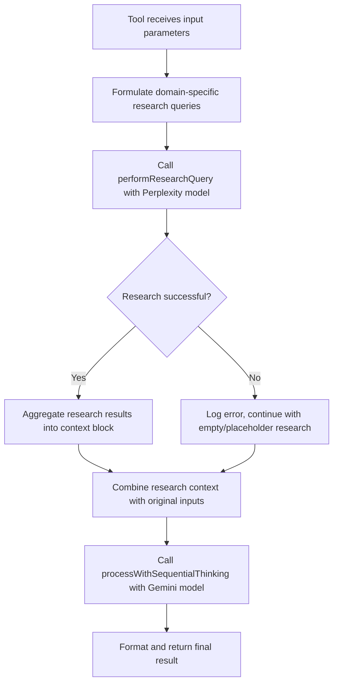
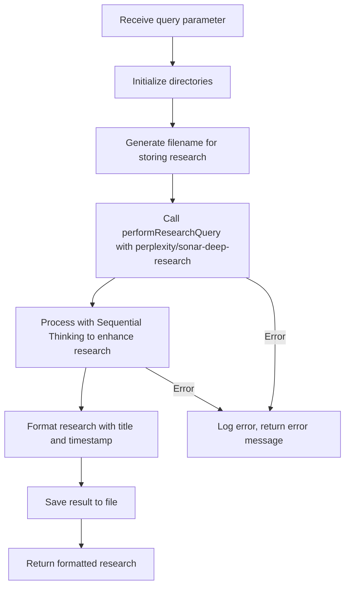
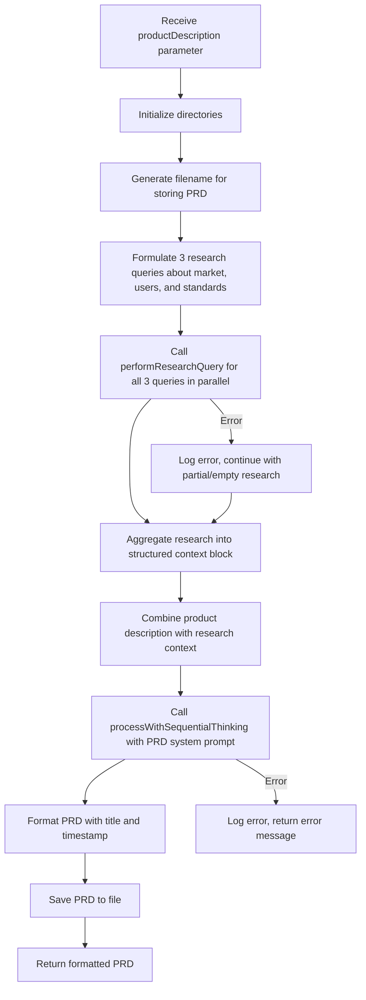
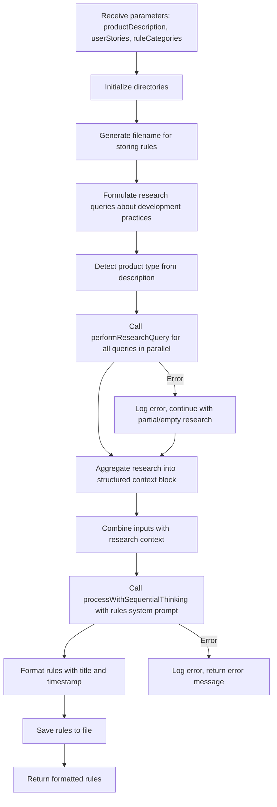
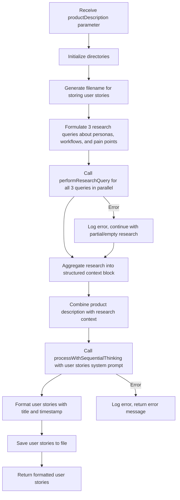
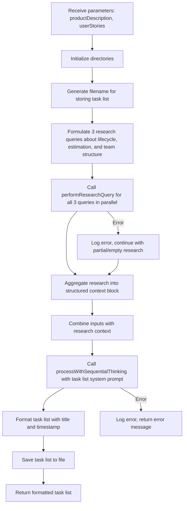
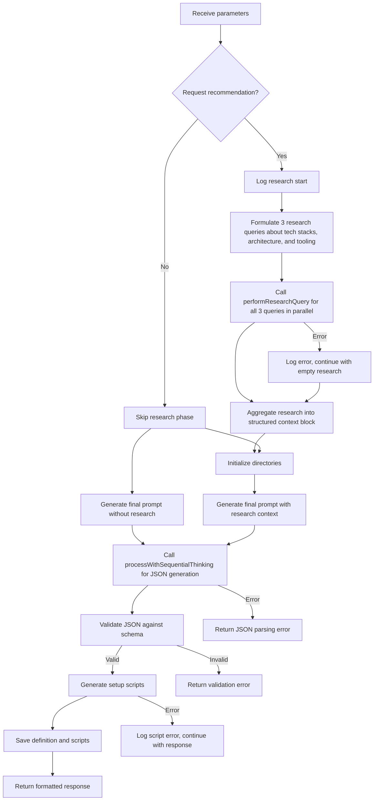

# Research Helper Integration in Vibe Coder MCP Tools

The `performResearchQuery` function in `src/utils/researchHelper.ts` serves as a centralized utility for deep research across multiple tools. This document outlines how each tool integrates with this research functionality.

## Common Research Helper Workflow

## 1. Research Manager Tool Flow

### Research Manager Implementation Details
- **Primary Function**: This tool's entire purpose is research
- **Research Query**: Directly uses the user's input query
- **Input → Research**: No transformation, directly passes user query 
- **Key Difference**: Uses Sequential Thinking to enhance raw research results
- **Output Format**: Formatted research document with title, content, and timestamp

## 2. PRD Generator Tool Flow

### PRD Generator Implementation Details
- **Research Queries**: 
  1. Market analysis and competitive landscape
  2. User needs, demographics, and expectations 
  3. Industry standards and best practices
- **Research Context Structure**: Organizes research into specific sections for the PRD generation
- **System Prompt**: Includes explicit instructions for utilizing the research context

## 3. Rules Generator Tool Flow

### Rules Generator Implementation Details
- **Research Queries**: 
  1. Best development practices and coding standards
  2. Specific rules or common categories (based on input)
  3. Architecture patterns for detected product type
- **Smart Detection**: Analyzes product description to detect type (web, mobile, API, game, etc.)
- **Conditional Query**: Second query varies based on provided rule categories

## 4. User Stories Generator Tool Flow

### User Stories Generator Implementation Details
- **Research Queries**: 
  1. User personas and stakeholders
  2. Common user workflows and use cases
  3. User experience expectations and pain points
- **System Prompt**: Specifically instructs to pay attention to "User Personas & Stakeholders" and "User Workflows & Use Cases" sections

## 5. Task List Generator Tool Flow

### Task List Generator Implementation Details
- **Research Queries**: 
  1. Development lifecycle tasks and milestones
  2. Task estimation and dependency management best practices
  3. Team structures and work breakdown patterns
- **Inputs Combination**: Merges both product description and user stories with research
- **System Prompt**: Focuses on "Development Lifecycle & Milestones" and "Task Estimation & Dependencies" sections

## 6. Fullstack Starter Kit Generator Tool Flow

### Fullstack Starter Kit Generator Implementation Details
- **Conditional Research**: Only performs research if `request_recommendation` is true
- **Research Queries**: 
  1. Technology stack recommendations
  2. Best practices and architectural patterns
  3. Modern development tooling and libraries
- **Structured Output**: Generates JSON that must validate against schema
- **Additional Processing**: Generates setup scripts from validated definition
- **Complex Flow**: Most complex integration with additional validation steps

## Key Observations

1. **Common Pattern**: All tools follow the same general pattern of using `performResearchQuery` for pre-generation research
2. **Parallel Execution**: Most tools execute multiple research queries in parallel for efficiency
3. **Error Handling**: All implementations gracefully handle research failures
4. **Model Specialization**: 
   - `performResearchQuery` consistently uses `perplexity/sonar-deep-research` for deep research
   - All tools then use `processWithSequentialThinking` with `gemini-2.0-flash-001` for generation
5. **Research Context Usage**: Each tool has specialized system prompts with instructions on how to use the research context

## Implementation Sophistication

| Tool                        | # Research Queries | Conditional Logic | Output Format |
|-----------------------------|--------------------|-------------------|---------------|
| Research Manager            | 1                  | No                | Markdown      |
| PRD Generator               | 3                  | No                | Markdown      |
| Rules Generator             | 3                  | Yes               | Markdown      |
| User Stories Generator      | 3                  | No                | Markdown      |
| Task List Generator         | 3                  | No                | Markdown      |
| Fullstack Starter Kit Gen.  | 3                  | Yes               | JSON + Scripts|
