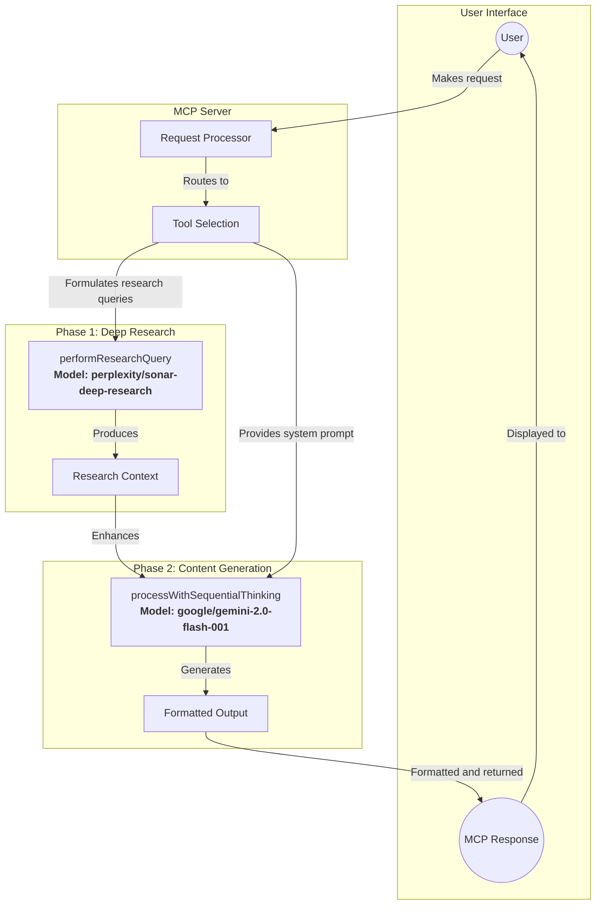

# Two-Phase Model Architecture in Vibe Coder MCP

Vibe Coder MCP employs a sophisticated two-phase model architecture that strategically uses different specialized models for distinct phases of operation. This document explains this architecture and how it's implemented across the system.

## Overall Architecture



## Centralized Research Architecture

```mermaid
flowchart TD
    Config[OpenRouterConfig\nperplexityModel: "perplexity/sonar-deep-research"\ngeminiModel: "google/gemini-2.0-flash-001"]
    
    RH[src/utils/researchHelper.ts\nperformResearchQuery]
    ST[src/tools/sequential-thinking.ts\nprocessWithSequentialThinking]
    
    Tool1[Research Manager]
    Tool2[PRD Generator]
    Tool3[Rules Generator]
    Tool4[User Stories Generator]
    Tool5[Task List Generator]
    Tool6[Fullstack Starter Kit Generator]
    
    Config -->|Provides models| RH
    Config -->|Provides models| ST
    
    Tool1 -->|Uses| RH
    Tool1 -->|Uses| ST
    
    Tool2 -->|Uses| RH
    Tool2 -->|Uses| ST
    
    Tool3 -->|Uses| RH
    Tool3 -->|Uses| ST
    
    Tool4 -->|Uses| RH
    Tool4 -->|Uses| ST
    
    Tool5 -->|Uses| RH
    Tool5 -->|Uses| ST
    
    Tool6 -->|Uses| RH
    Tool6 -->|Uses| ST
    
    RH -->|Uses| OpenRouter[OpenRouter API]
    ST -->|Uses| OpenRouter
```

## Key Components

### 1. Research Helper (`src/utils/researchHelper.ts`)

```typescript
export async function performResearchQuery(query: string, config: OpenRouterConfig): Promise<string> {
  logger.debug({ query, model: config.perplexityModel }, "Performing Perplexity research query");
  if (!config.perplexityModel) {
    throw new Error("Perplexity model name is not configured.");
  }
  try {
    const response = await axios.post(
      `${config.baseUrl}/chat/completions`,
      {
        model: config.perplexityModel, // Uses perplexity/sonar-deep-research
        messages: [
          { role: "system", content: "You are a sophisticated AI research assistant..." },
          { role: "user", content: query }
        ],
        max_tokens: 4000,
        temperature: 0.1
      },
      // ...
    );
    // ...
  }
}
```

### 2. Sequential Thinking (`src/tools/sequential-thinking.ts`)

Although we don't have the full code for this file, it likely looks something like:

```typescript
export async function processWithSequentialThinking(
  prompt: string, 
  config: OpenRouterConfig,
  systemPrompt?: string
): Promise<string> {
  // ...
  const response = await axios.post(
    `${config.baseUrl}/chat/completions`,
    {
      model: config.geminiModel, // Uses google/gemini-2.0-flash-001
      messages: [
        { role: "system", content: systemPrompt || "Default system prompt..." },
        { role: "user", content: prompt }
      ],
      // ...
    }
  );
  // ...
}
```

### 3. Configuration Definition (`src/types/workflow.ts`)

```typescript
export interface OpenRouterConfig {
  baseUrl: string;
  apiKey: string;
  geminiModel: string;    // For generation tasks
  perplexityModel: string; // For research tasks
}
```

### 4. Configuration Values (`.env`)

```
# OpenRouter Configuration
OPENROUTER_API_KEY=your_openrouter_api_key_here
OPENROUTER_BASE_URL=https://openrouter.ai/api/v1
GEMINI_MODEL=google/gemini-2.0-flash-001
PERPLEXITY_MODEL=perplexity/sonar-deep-research
```

## Benefits of Two-Phase Approach

1. **Specialized Models**: Each phase uses a model specifically optimized for its task
   - Perplexity Sonar excels at deep, thorough research
   - Gemini Flash is optimized for faster response times in content generation

2. **Separated Concerns**:
   - Research phase focuses on gathering comprehensive information
   - Generation phase focuses on producing well-structured output

3. **Cost Efficiency**:
   - Uses expensive deep research model only when necessary
   - Uses faster, potentially less expensive model for standard generation

4. **Improved Quality**:
   - Research provides contextual depth to generation
   - Generation benefits from specialized research without having to perform it

5. **Error Resilience**:
   - If research fails, generation can still proceed
   - Each phase has independent error handling

## System-Wide Implementation

The two-phase model architecture is consistently implemented across all tools in the system:

1. All tools use `performResearchQuery` for the research phase
2. All tools use `processWithSequentialThinking` for the generation phase
3. Environment variables and central configuration ensure consistency
4. Each tool has specialized system prompts that instruct the generation model on how to best utilize the research context

This architecture allows Vibe Coder MCP to deliver high-quality, deeply researched outputs while maintaining reasonable performance characteristics.
